# 📘 เอกสารอธิบาย Neural Network สำหรับทำนายราคาน้ำมัน Brent

## วัตถุประสงค์
ใช้ Neural Network (Multi-layer Perceptron) ในการทำนายราคาน้ำมันดิบ Brent ในวันถัดไป โดยใช้ข้อมูลราคาย้อนหลังของน้ำมัน Brent และ WTI

---

## 📊 Workflow Diagram (ขั้นตอนการทำงาน)

```mermaid
flowchart TD
    subgraph "1️⃣ การเตรียมข้อมูล"
        A[Import Libraries<br/>นำเข้าไลบรารี] --> B[Load Data<br/>โหลดข้อมูลราคาน้ำมัน]
        B --> C[Data Exploration<br/>สำรวจข้อมูลเบื้องต้น]
        C --> D[Check Missing Values<br/>ตรวจสอบข้อมูลที่หายไป]
    end

    subgraph "2️⃣ Feature Engineering"
        D --> E[Create Lagged Features<br/>สร้าง features ราคาย้อนหลัง]
        E --> F[Create Moving Averages<br/>สร้างค่าเฉลี่ยเคลื่อนที่]
        F --> G[Create Target Variable<br/>สร้างตัวแปรเป้าหมาย]
    end

    subgraph "3️⃣ การเตรียมข้อมูลสำหรับ Training"
        G --> H[Select Features<br/>เลือก features ที่ใช้]
        H --> I[Train-Val-Test Split<br/>แบ่งข้อมูล 70-15-15]
        I --> J[Normalize Features<br/>Normalize ข้อมูล]
    end

    subgraph "4️⃣ การสร้างและ Train Model"
        J --> K[Create MLP Model<br/>สร้าง Neural Network]
        K --> L[Train Model<br/>Training โมเดล]
    end

    subgraph "5️⃣ การประเมินผล"
        L --> M[Make Predictions<br/>ทำนายผลลัพธ์]
        M --> N[Calculate Metrics<br/>คำนวณ RMSE, MAE, R²]
        N --> O[Visualize Results<br/>แสดงกราฟผลลัพธ์]
    end

    style A fill:#e1f5fe
    style K fill:#fff3e0
    style N fill:#e8f5e9
```



---

## 📦 กล่องที่ 1: Import Libraries (นำเข้าไลบรารี)

```python
# นำเข้าไลบรารี pandas สำหรับจัดการข้อมูลในรูปแบบ DataFrame
import pandas as pd

# นำเข้า numpy สำหรับการคำนวณทางคณิตศาสตร์และจัดการ array
import numpy as np

# นำเข้า matplotlib สำหรับสร้างกราฟและแผนภูมิ
import matplotlib.pyplot as plt

# นำเข้า seaborn สำหรับสร้างกราฟที่สวยงามกว่า matplotlib
import seaborn as sns

# นำเข้า MLPRegressor - Neural Network สำหรับงาน Regression
# MLP = Multi-layer Perceptron ซึ่งเป็น Neural Network แบบ Feedforward
from sklearn.neural_network import MLPRegressor

# นำเข้า StandardScaler สำหรับ Normalize ข้อมูล (ปรับ Mean=0, Std=1)
from sklearn.preprocessing import StandardScaler

# นำเข้า metrics สำหรับวัดประสิทธิภาพโมเดล:
# - mean_squared_error: ค่าความคลาดเคลื่อนกำลังสองเฉลี่ย
# - mean_absolute_error: ค่าความคลาดเคลื่อนสัมบูรณ์เฉลี่ย  
# - r2_score: ค่า R² แสดงความสามารถในการอธิบายข้อมูล
from sklearn.metrics import mean_squared_error, mean_absolute_error, r2_score

# นำเข้า warnings และปิด warnings เพื่อไม่ให้รบกวนผลลัพธ์
import warnings
warnings.filterwarnings('ignore')

# ตั้งค่าสไตล์กราฟให้มี grid สีขาว
sns.set_style('whitegrid')

# ตั้งค่าขนาดกราฟเริ่มต้นเป็น 12x6 นิ้ว
plt.rcParams['figure.figsize'] = (12, 6)
```

---

## 📦 กล่องที่ 2: Load Data (โหลดข้อมูล)

```python
# โหลดข้อมูลราคาน้ำมันจากไฟล์ CSV
# ไฟล์นี้รวมข้อมูล Brent (suffix _x) และ WTI (suffix _y)
df = pd.read_csv('../data/processed/merged_oil_prices.csv')

# แปลงคอลัมน์ 'date' เป็นชนิด datetime เพื่อให้จัดการวันที่ได้ง่าย
df['date'] = pd.to_datetime(df['date'])

# เรียงลำดับข้อมูลตามวันที่จากเก่าไปใหม่
# reset_index(drop=True) ลบ index เดิมและสร้าง index ใหม่ตั้งแต่ 0
df = df.sort_values('date').reset_index(drop=True)

# แสดงจำนวนแถวข้อมูล
print(f'จำนวนข้อมูล: {len(df)} แถว')

# แสดงช่วงเวลาของข้อมูล (วันแรก ถึง วันสุดท้าย)
print(f'ช่วงเวลา: {df["date"].min()} ถึง {df["date"].max()}')

# แสดงรายชื่อคอลัมน์ทั้งหมดในข้อมูล
print(df.columns.tolist())

# แสดงข้อมูล 5 แถวแรกเพื่อดูโครงสร้างข้อมูล
df.head()
```

---

## 📦 กล่องที่ 3: Data Statistics (สถิติข้อมูล)

```python
# แสดงสถิติพื้นฐานของข้อมูล:
# - count: จำนวนข้อมูล
# - mean: ค่าเฉลี่ย
# - std: ส่วนเบี่ยงเบนมาตรฐาน
# - min/max: ค่าต่ำสุด/สูงสุด
# - 25%/50%/75%: ค่า percentile ที่ 25, 50 (median), 75
df.describe()
```

---

## 📦 กล่องที่ 4: Check Missing Values (ตรวจสอบข้อมูลที่หายไป)

```python
# นับจำนวนค่า missing (NaN/null) ในแต่ละคอลัมน์
# isnull() คืนค่า True/False สำหรับแต่ละเซลล์
# sum() นับจำนวน True (ค่าที่หายไป)
print(df.isnull().sum())

# ตรวจสอบว่ามีค่า missing หรือไม่
# sum().sum() รวมค่า missing ทั้งหมดจากทุกคอลัมน์
if df.isnull().sum().sum() == 0:
    print('✓ ไม่มีค่า missing ในข้อมูล')
else:
    print('✗ พบค่า missing ในข้อมูล')
```

---

## 📦 กล่องที่ 5: Feature Engineering (สร้าง Features)

```python
# สร้างสำเนา DataFrame เพื่อไม่ให้กระทบข้อมูลต้นฉบับ
data = df.copy()

# สร้าง Lagged Features สำหรับ Brent (ราคาย้อนหลัง)
# shift(lag) เลื่อนข้อมูลลง lag แถว (ดึงค่าจากอดีต)
for lag in [1, 3, 5, 7]:
    # brent_lag_1 = ราคา Brent เมื่อ 1 วันก่อน
    # brent_lag_3 = ราคา Brent เมื่อ 3 วันก่อน (และต่อไป)
    data[f'brent_lag_{lag}'] = data['close_x'].shift(lag)

# สร้าง Lagged Features สำหรับ WTI
for lag in [1, 3, 5, 7]:
    # wti_lag_1 = ราคา WTI เมื่อ 1 วันก่อน
    data[f'wti_lag_{lag}'] = data['close_y'].shift(lag)

# สร้าง Moving Averages สำหรับ Brent
# rolling(window=5) คำนวณค่าเฉลี่ยของ 5 วันย้อนหลัง
data['brent_ma_5'] = data['close_x'].rolling(window=5).mean()
data['brent_ma_10'] = data['close_x'].rolling(window=10).mean()

# สร้าง Moving Averages สำหรับ WTI
data['wti_ma_5'] = data['close_y'].rolling(window=5).mean()
data['wti_ma_10'] = data['close_y'].rolling(window=10).mean()

# สร้าง Target Variable (ตัวแปรที่ต้องการทำนาย)
# shift(-1) เลื่อนข้อมูลขึ้น 1 แถว = ราคาวันถัดไป
# นี่คือสิ่งที่โมเดลจะพยายามทำนาย
data['target'] = data['close_x'].shift(-1)

# ลบแถวที่มี NaN ออก (เกิดจากการ shift และ rolling)
# แถวแรกๆ จะไม่มีค่า lag, แถวสุดท้ายจะไม่มี target
data_clean = data.dropna().reset_index(drop=True)
```

---

## 📦 กล่องที่ 6: Select Features (เลือก Features)

```python
# กำหนดรายชื่อ Features ที่จะใช้ในการทำนาย
feature_columns = [
    # Brent Features (ราคาปัจจุบันและย้อนหลัง)
    'close_x', 'open_x', 'high_x', 'low_x', 'average_x',
    'brent_lag_1', 'brent_lag_3', 'brent_lag_5', 'brent_lag_7',
    'brent_ma_5', 'brent_ma_10',
    
    # WTI Features (น้ำมัน WTI มักมีความสัมพันธ์กับ Brent)
    'close_y', 'open_y', 'high_y', 'low_y', 'average_y',
    'wti_lag_1', 'wti_lag_3', 'wti_lag_5', 'wti_lag_7',
    'wti_ma_5', 'wti_ma_10'
]

# X = Features (ตัวแปรอิสระ) - ข้อมูลที่ใช้ทำนาย
X = data_clean[feature_columns]

# y = Target (ตัวแปรตาม) - ราคา Brent วันถัดไปที่ต้องการทำนาย
y = data_clean['target']
```

---

## 📦 กล่องที่ 7: Train-Validation-Test Split (แบ่งข้อมูล)

```python
# แบ่งข้อมูลแบบ Time Series (ไม่สุ่ม เพราะเป็นข้อมูลตามเวลา)
# Training: 70% - ข้อมูลสำหรับสอนโมเดล
train_size = int(len(X) * 0.7)

# Validation: 15% - ข้อมูลสำหรับปรับแต่งโมเดล
val_size = int(len(X) * 0.15)

# Training Set (ข้อมูล 0 ถึง train_size)
X_train = X[:train_size]
y_train = y[:train_size]

# Validation Set (ข้อมูล train_size ถึง train_size+val_size)
X_val = X[train_size:train_size+val_size]
y_val = y[train_size:train_size+val_size]

# Test Set (ข้อมูลที่เหลือทั้งหมด ประมาณ 15%)
# ใช้ทดสอบประสิทธิภาพโมเดลครั้งสุดท้าย
X_test = X[train_size+val_size:]
y_test = y[train_size+val_size:]
```

> [!IMPORTANT]
> **ทำไมต้องแบ่งแบบ Time Series?**  
> เพราะข้อมูลราคาน้ำมันเป็นข้อมูลตามลำดับเวลา การสุ่มแบ่งจะทำให้โมเดล "เห็นอนาคต" ซึ่งผิดหลักการ ต้องใช้ข้อมูลในอดีตเพื่อทำนายอนาคตเท่านั้น

---

## 📦 กล่องที่ 8: Normalize Features (Normalize ข้อมูล)

```python
# สร้าง StandardScaler สำหรับ Normalize ข้อมูล
# StandardScaler จะปรับข้อมูลให้มี Mean=0 และ Std=1
scaler = StandardScaler()

# fit_transform กับ Training Set
# fit: คำนวณ mean และ std จาก Training Set
# transform: แปลงข้อมูลโดยใช้ค่า mean และ std ที่คำนวณได้
X_train_scaled = scaler.fit_transform(X_train)

# transform เฉพาะ (ไม่ fit) กับ Validation และ Test Set
# ใช้ mean และ std จาก Training Set เพื่อหลีกเลี่ยง data leakage
X_val_scaled = scaler.transform(X_val)
X_test_scaled = scaler.transform(X_test)
```

> [!TIP]
> **ทำไมต้อง Normalize?**  
> Neural Network ทำงานได้ดีกว่าเมื่อข้อมูลอยู่ในช่วงใกล้เคียงกัน ถ้า features มีสเกลต่างกันมาก (เช่น ราคา 70 เทียบกับ volume 10000) โมเดลจะเรียนรู้ได้ช้าและไม่สม่ำเสมอ

---

## 📦 กล่องที่ 9: Create Neural Network Model (สร้างโมเดล)

```python
# สร้าง Multi-Layer Perceptron Regressor
model = MLPRegressor(
    # hidden_layer_sizes: กำหนดจำนวน neurons ในแต่ละ hidden layer
    # (64, 32, 16) = Layer 1: 64 neurons, Layer 2: 32 neurons, Layer 3: 16 neurons
    hidden_layer_sizes=(64, 32, 16),
    
    # activation: ฟังก์ชัน activation สำหรับ hidden layers
    # 'relu' = ReLU (Rectified Linear Unit) - max(0, x)
    activation='relu',
    
    # solver: อัลกอริทึมสำหรับ optimize weights
    # 'adam' = Adaptive Moment Estimation - นิยมใช้กับ Deep Learning
    solver='adam',
    
    # alpha: ค่า L2 regularization เพื่อป้องกัน overfitting
    # ค่ายิ่งสูงยิ่งลด overfitting แต่อาจ underfit
    alpha=0.001,
    
    # batch_size: จำนวน samples ที่ใช้ในแต่ละ iteration
    # 'auto' = ใช้ค่าเริ่มต้นตามอัลกอริทึม
    batch_size='auto',
    
    # learning_rate: วิธีปรับ learning rate
    # 'adaptive' = ลด learning rate เมื่อ loss ไม่ลด
    learning_rate='adaptive',
    
    # learning_rate_init: ค่า learning rate เริ่มต้น
    learning_rate_init=0.001,
    
    # max_iter: จำนวน epochs สูงสุด
    max_iter=200,
    
    # shuffle: สุ่มลำดับข้อมูลในแต่ละ epoch
    shuffle=True,
    
    # random_state: กำหนด seed เพื่อให้ผลลัพธ์สามารถทำซ้ำได้
    random_state=42,
    
    # early_stopping: หยุด training เมื่อ validation loss ไม่ดีขึ้น
    early_stopping=True,
    
    # validation_fraction: สัดส่วนข้อมูลสำหรับ validation (จาก training set)
    validation_fraction=0.15,
    
    # n_iter_no_change: จำนวน epochs ที่รอก่อนหยุด (ถ้า loss ไม่ดีขึ้น)
    n_iter_no_change=10,
    
    # verbose: แสดงข้อมูล training progress
    verbose=True
)
```

---

## 📦 กล่องที่ 10: Train and Evaluate (Training และประเมินผล)

### Training Model

```python
# Train โมเดลด้วย Training Data
# fit() คือขั้นตอนหลักที่โมเดลเรียนรู้จากข้อมูล
# X_train_scaled: features ที่ normalized แล้ว
# y_train: ราคา Brent วันถัดไปที่ต้องการทำนาย
model.fit(X_train_scaled, y_train)

# ตรวจสอบจำนวน iterations ที่ใช้จริง
print(f'จำนวน iterations ที่ใช้: {model.n_iter_}')

# ตรวจสอบ Loss สุดท้าย (ยิ่งต่ำยิ่งดี)
print(f'Loss สุดท้าย: {model.loss_:.4f}')
```

### Make Predictions (ทำนายผลลัพธ์)

```python
# ทำนายราคาน้ำมันสำหรับแต่ละ dataset
# predict() ใช้โมเดลที่ train แล้วทำนายค่า y จาก X

y_train_pred = model.predict(X_train_scaled)  # ทำนายบน Training Set
y_val_pred = model.predict(X_val_scaled)      # ทำนายบน Validation Set
y_test_pred = model.predict(X_test_scaled)    # ทำนายบน Test Set
```

### Calculate Metrics (คำนวณตัวชี้วัด)

```python
def calculate_metrics(y_true, y_pred, dataset_name):
    """
    คำนวณและแสดงตัวชี้วัดประสิทธิภาพโมเดล
    
    Parameters:
    - y_true: ค่าจริง
    - y_pred: ค่าที่ทำนาย
    - dataset_name: ชื่อ dataset
    """
    
    # RMSE (Root Mean Squared Error)
    # วัดความคลาดเคลื่อนเฉลี่ย โดยให้น้ำหนักกับ error ใหญ่มากขึ้น
    # ค่ายิ่งต่ำยิ่งดี
    rmse = np.sqrt(mean_squared_error(y_true, y_pred))
    
    # MAE (Mean Absolute Error)
    # ค่าความคลาดเคลื่อนสัมบูรณ์เฉลี่ย
    # ตีความง่าย: เฉลี่ยแล้วทำนายคลาดเคลื่อนกี่ดอลลาร์
    mae = mean_absolute_error(y_true, y_pred)
    
    # R² (Coefficient of Determination)
    # วัดว่าโมเดลอธิบายความแปรปรวนของข้อมูลได้กี่ %
    # ค่า 1 = สมบูรณ์แบบ, ค่า 0 = ไม่ดีเลย
    r2 = r2_score(y_true, y_pred)
    
    print(f'{dataset_name} Results:')
    print(f'  RMSE: ${rmse:.4f}')  # หน่วยเป็นดอลลาร์
    print(f'  MAE:  ${mae:.4f}')
    print(f'  R²:   {r2:.4f}')
    
    return {'RMSE': rmse, 'MAE': mae, 'R2': r2}

# คำนวณ metrics สำหรับทุก dataset
train_metrics = calculate_metrics(y_train, y_train_pred, 'Training Set')
val_metrics = calculate_metrics(y_val, y_val_pred, 'Validation Set')
test_metrics = calculate_metrics(y_test, y_test_pred, 'Test Set')
```

---

## ✅ ตรวจสอบความถูกต้องของหลักการ

### หลักการที่ใช้ในโค้ดถูกต้องหรือไม่?

| ลำดับ | หลักการ | สถานะ | คำอธิบาย |
|:---:|---------|:-----:|----------|
| 1 | Import Libraries | ✅ ถูกต้อง | ใช้ไลบรารีมาตรฐานสำหรับ ML |
| 2 | Load & Explore Data | ✅ ถูกต้อง | ตรวจสอบข้อมูลก่อน processing |
| 3 | Check Missing Values | ✅ ถูกต้อง | จำเป็นก่อนสร้าง features |
| 4 | Feature Engineering | ✅ ถูกต้อง | Lag + MA เป็น features มาตรฐานสำหรับ Time Series |
| 5 | Train-Val-Test Split | ✅ ถูกต้อง | แบ่งแบบ Time Series ไม่ shuffle |
| 6 | Normalization | ✅ ถูกต้อง | fit บน train, transform บน val/test |
| 7 | Model Architecture | ✅ ถูกต้อง | 3 hidden layers เหมาะสม |
| 8 | Early Stopping | ✅ ถูกต้อง | ป้องกัน overfitting |
| 9 | Evaluation Metrics | ✅ ถูกต้อง | RMSE, MAE, R² เป็น metrics มาตรฐาน |

### ข้อสังเกตเพิ่มเติม

> [!NOTE]
> **ผลลัพธ์จากการ Training:**
> - Training R² = 0.9903 (โมเดลอธิบายข้อมูล training ได้ 99%)
> - Test R² = 0.8545 (โมเดลอธิบายข้อมูล test ได้ 85%)
> - MAE บน Test = $0.98 (เฉลี่ยทำนายคลาดเคลื่อน ~$1)

> [!TIP]
> **ข้อเสนอแนะในการปรับปรุง:**
> 1. อาจลอง LSTM/GRU ที่เหมาะกับ Time Series มากกว่า MLP
> 2. เพิ่ม features อื่นๆ เช่น Volume, ความผันผวน
> 3. ลอง Cross-Validation แบบ Time Series

---

## 📈 สรุป

โค้ดใน `Neural_Network.ipynb` มีโครงสร้างและหลักการที่ถูกต้องตามมาตรฐานการพัฒนาโมเดล Machine Learning โดยมีขั้นตอนครบถ้วนตั้งแต่:

1. **การเตรียมข้อมูล** - โหลด, สำรวจ, ตรวจสอบ Missing Values
2. **Feature Engineering** - สร้าง Lagged Features และ Moving Averages
3. **การแบ่งข้อมูล** - แบ่งแบบ Time Series (70-15-15)
4. **Normalization** - ใช้ StandardScaler อย่างถูกต้อง
5. **Model Training** - ใช้ MLP พร้อม Early Stopping
6. **การประเมินผล** - ใช้ RMSE, MAE, R² ที่เป็นมาตรฐาน
